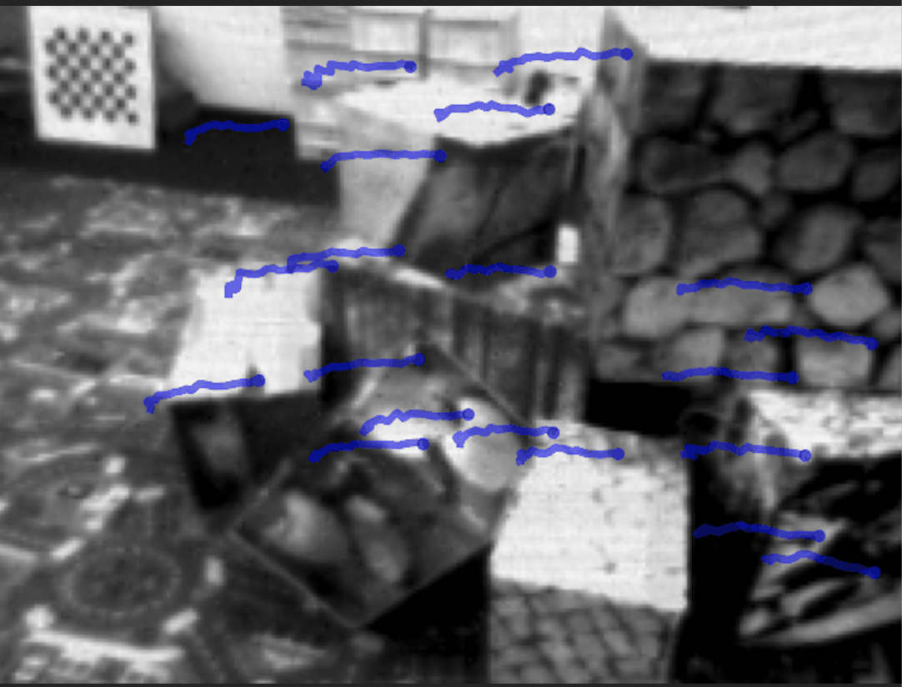

# Reproducting "Data-driven Feature Tracking for Event Cameras"
Authors:

- Jorn Teurlings 4956818
    - Writing the introduction and general information
    - Attempt at generating tracks for EC Dataset
    - Working on the evaluation and reproducing of the results
- Xiaotong Li 5965373
    - Evaluating the generalization ability of the networks with different weights on different datasets
    - Writing a bash script for preparing the data
    - Making the poster
- Ziang Liu 5978866
    - Modify the mistakes in train.py
    - Write a .bat for preparing pose data
    - Fine-tuning the model
- Siqi Pei 5964377
    - Evaluating the given weights
    - Preparing the pose data
    - Fine-tuning the model

Github Link: https://github.com/JornTeurlings/deep_ev_tracker.git

Paper Link: https://arxiv.org/abs/2211.12826
 


## Introduction
In the realm of computer vision and augmented/virtual reality (AR/VR), the challenge of effectively tracking features in high-speed motion scenes is a pivotal concern, especially as AR/VR devices become increasingly common. Standard cameras, the typical choice for these applications, face significant limitations due to the bandwidth-latency trade-off and motion blur in low-light, high-speed scenarios. These limitations complicate the tracking process, affecting both the efficiency and accuracy of feature tracking under rapid movements. Event cameras, inspired by biological vision mechanisms, offer a promising alternative due to their high temporal resolution and dynamic range, coupled with low power consumption. In this blog, we aim to reproduce the results in the paper by introduces a novel data-driven feature tracker for event cameras that combines the strengths of event cameras with traditional frames to enhance tracking accuracy and efficiency. The focus of this paper will be directed towards the 

## Network architecture

### Joint Encoder + Feature Network (x2 Patch Encoder)
| Layer | Spatial Size |
|-------|--------------|
| 2x Conv2D 1x1x32 | 31x31 |
| 2x Conv2D 5x5x64 | 23x23 |
| 2x Conv2D 5x5x128 | 15x15 |
| 2x Conv2D 3x3x256 | 5x5 |
| 2x Conv2D 1x1x384 | 1x1 |
| Up + Conv2D 1x1x384 | 5x5 |
| Conv2D 3x3x384 | 5x5 |
| Up + Conv2D 1x1x384 | 15x15 |
| Conv2D 3x3x384 | 15x15 |
| Up + Conv2D 1x1x384 | 23x23 |
| Conv2D 3x3x384 | 23x23 |
| Up + Conv2D 1x1x384 | 31x31 |
| Conv2D 3x3x384 | 31x31 |
| 2x Conv2D 3x3x384 | 31x31 |
| Correlation Layer | 31x31 |
| 2x Conv2D 3x3x128 | 31x31 |
| 2x Conv2D 3x3x64 | 15x15 |
| 2x Conv2D 3x3x128 | 7x7 |
| ConvLSTM 3x3x128 | 7x7 |
| 2x Conv2D 3x3x256 | 3x3 |
| Conv2D 3x3x256 | 1x1 |

### Frame Attention Module
| Layer | Spatial Size |
|-------|--------------|
| Linear 256 | 1x1 |
| Linear 256 | 1x1 |
| MultiHead Attention | 1x1 |
| LayerScale 256 | 1x1 |
| Linear Gating 256 | 1x1 |
| Linear 2 | 1x1 |

The activation layers that are used are mostly Leaky ReLU's. The Softmax and ReLU are also used inside the network setup. 


## Pretrained Weights
Since the training of this model in the original paper is done on the Multiflow Dataset which has a total size of 1.48TB, the authors of the paper have given the weights of those models trained on the MultiFlow, EDS and EC dataset. The network as such is tested and retrained solely on data fine-tuned on the EC dataset.

An attempt is made to generate new tracks for unknown EC datasets but this unfortunately was not attainable due to the limited amount of information presented for the method in which they generated the tracks for the EC datasets.

## Goal of reproduction
In this reproduction, the goal is to verify the working and the network architecture that is used including the method of training and. The working of the architecture is compared agains their reported results. Also assessing the capability of the network to generalize against unseen data and training it on new data for fine tuning are experimented with. 

## Experiments and tests
### Getting a new dataset of EC

The following steps must be taken to generate an own representation on which can be evaluated or tested on:

1. Find online the EC Dataset which contains the following files:
    - events.txt: One event per line (timestamp x y polarity)
    - images.txt: One image reference per line (timestamp filename)
    - images/00000001.png: Images referenced from images.txt
    - imu.txt: One measurement per line (timestamp ax ay az gx gy gz)
    - groundtruth.txt: One ground truth measurements per line (timestamp px py pz qx qy qz qw)
    - calib.txt: Camera parameters (fx fy cx cy k1 k2 p1 p2 k3)

2. Put this inside the already created `ec_subseq` folder
3. Execute the `prepare_ec_subseq.py` file for the respective dataset and indexes of choice. This might take a while. Additionaly, its an option to execute the `prepare_ec_pose_supervision.py` for pose representations for fine tuning and training.
4. Unfortunately, it did not get further then this. The files with `.gt.txt` created by the owners for the EC dataset have been generated outside of the code in this repository and seemingly. Modifications of the `generate_track.py` within the timeframe were to no avail. For a better view on the generalization capability of the network, a newly generated set would be optimal to check the finetuned weights. The `generate_track.py` file only allows for multiflow datasets to generate tracks for. 

Future recommendations in this department are therefore to reach out to the authors of the original paper asking how to generate the tracks for non-multiflow data

### Reproduction of paper results
To setup the experiment, it is important that some configurations are set which do not fully align with the procedure in the README. The results are ran on a Macbook M2 Pro without CUDA. Below are the steps taken to reproduce our results:

1. Download the EC subseq dataset and the pretrained weights found on https://github.com/uzh-rpg/deep_ev_tracker
2. Locally instantiate the repository
3. Make sure the requirements.txt are installed using `pip install -r requirements.txt`. Important note: Some files are not installable on an M2 through pip. To make sure you are able to reproduce on an M2:
    1. Manually install hdf5 using `$ brew install hdf5`
    2. Now execute `conda install h5py hdf5plugin`
    3. Another issue that can arise is the NumPy version for SciPy. Simply manually install a numpy version that does work with the respective environment
5. Add the `ec_subseq` folder to your root and the weights under `pretrained_weights` folder
6. Inside the `evaluate_real_defaults.yml` replace the `<path>` with the absolute path to your root folder (since there were issues using the `<path>`)
7. Make the weights_path equal to the path that is being evaluated, in this case `ROOT/pretrained_weights/weights_fintuned_ec.ckpt`
8. Set the `visualize: True` to also get the videos of the feature tracks being followed
9. Inside the `pose_ec.yml` set the root_dir to point towards the `ec_subseq` folder
10. Execute the command `python evaluate_real.py` from the root of your directory
11. Under the folder `correlation3_unscaled`, there should be a folder that contains `.txt` files. Create a new folder named `network_pred` in the root and place all `.txt` files in this folder.
12. From the root folder run the command `python scripts/benchmark.py`
13. The results for all the dataset elements are now printed to the terminal and printed in a csv under `benchmark_results`

By evaluating the `evaluate_real.py` file that is found in the repository associated with the paper, the network runs the network against certain images in the EC dataset with the ground truth corners that it should track. When the network predictions are made, the `benchmark.py` script is ran. This compares the tracks generated with the ground_truth tracks. The following points are then returned from this script:
- Mean and standard deviation of the Feature Age
- Mean and standard deviation of the Inlier Ratio
- The expected Feature Age


These quantities mean the following: 
- Feature age: how long it takes before the feature has a certain distance from the ground truth (normalized relative to the ground truth track duration)
- Inlier ratio: fraction of succesfully predicted tracks over the number of given feature locations. A feature is defined to be tracked successfully if the predicted feature location at the second timestep after initialization is in the termination threshold to the ground truth location.
- Expected Feature Age: The normalized feature age multiplied by the inlier ratio. Basically only takes into account stable tracks (tracks that were not lost early in the process of the sequence for the feature age computations)

Comparing the results in the paper with the the found results, it is clear that results match up. The inlier ratio's almost perfectly align. The expected feature age only has only the largest discrepancy of 0.02 in the findings.

**EC**
| Sequence Name             | Feature Age               | Inlier Ratio      | Expected Feature Age      |
|---------------------------|---------------------------|-------------------|---------------------------|
| Shapes Translation   | 0.87 ± 0.21       | 0.96 ± 0.16       | 0.86        |
| Shapes Rotation   | 0.80 ± 0.26       | 0.95 ± 0.16       | 0.79        |
| Shapes 6DOF       | 0.90 ± 0.22       | 0.95 ± 0.16       | 0.88        |
| Boxes Translation | 0.84 ± 0.16       | 0.98 ± 0.10       | 0.84        |
| Boxes Rotatioon    | 0.70 ± 0.27       | 0.95 ± 0.18       | 0.70        |

Also when comparing the tracks that are made at the same image frame, it is clear that the performance is similar and that the results mentioned do not deviate a lot with respect to the published results. Do note that the image in the paper is different since it also represents the ground truth in there. 




 
### Generalization ability of the networks
We test three differnt weights (Multiflow weights without fine-tune, weights fine-tuned on EC datasets and weights fine-tuned on EDS datasets) on EC and EDS dataset to see the generalization ability of the model.

**Results of Multiflow weights**
| Sequence Name      | Feature Age | Inlier Ratio | Expected Feature Age |
| ------------------ | ----------- |:------------:| -------------------- |
| EDS datasets       |             |              |                      |
| peanuts_light      | 0.43 ± 0.29 | 0.80 ±0.29  | 0.40                 |
| rocket_earth_light | 0.62 ± 0.30 | 0.36 ± 0.21  | 0.28                 |
| ziggy_in_the_arena | 0.70 ± 0.31 | 0.92 ±0.22  | 0.70                 |
| peanuts_running    | 0.45 ± 0.28 | 0.73 ±0.35  | 0.42                 |
| EC datasets        |             |              |                      |
| Shapes Translation | 0.79 ± 0.17 | 0.97 ± 0.15  | 0.79                 |
| Shapes Rotation    | 0.78 ± 0.25 | 0.95 ± 0.18  | 0.78                 |
| Shapes 6DOF        | 0.90 ± 0.21 | 0.95 ± 0.16  | 0.88                 |
| Boxes Translation  | 0.87 ± 0.19 | 0.97 ± 0.12  | 0.87                 |
| Boxes Rotatioon    | 0.64 ± 0.24 | 0.95 ± 0.18  | 0.64                 |

**Results of fine-tune weights on EC datasets**
| Sequence Name      | Feature Age | Inlier Ratio | Expected Feature Age |
| ------------------ | ----------- |:------------:| -------------------- |
| EDS datasets       |             |              |                      |
| peanuts_light      | 0.42 ± 0.29 | 0.83 ±0.30  | 0.40                 |
| rocket_earth_light | 0.60 ± 0.29 | 0.37 ± 0.21  | 0.27                 |
| ziggy_in_the_arena | 0.70 ± 0.30 | 0.92 ± 0.21  | 0.70                 |
| peanuts_running    | 0.40 ± 0.23 | 0.73 ±0.35  | 0.37                 |
| EC datasets        |             |              |                      |
| Shapes Translation | 0.87 ± 0.21 | 0.96 ± 0.16  | 0.86                 |
| Shapes Rotation    | 0.80 ± 0.26 | 0.95 ± 0.16  | 0.79                 |
| Shapes 6DOF        | 0.90 ± 0.22 | 0.95 ± 0.16  | 0.88                 |
| Boxes Translation  | 0.84 ± 0.16 | 0.98 ± 0.10  | 0.84                 |
| Boxes Rotatioon    | 0.70 ± 0.27 | 0.95 ± 0.18  | 0.70                 |

**Results of fine-tune weights on EDS datasets**
| Sequence Name      | Feature Age | Inlier Ratio | Expected Feature Age |
| ------------------ | ----------- |:------------:| -------------------- |
| EDS datasets       |             |              |                      |
| peanuts_light      | 0.43 ± 0.29 | 0.80 ±0.30  | 0.40                 |
| rocket_earth_light | 0.64 ± 0.31 | 0.36 ± 0.21  | 0.29                 |
| ziggy_in_the_arena | 0.70 ± 0.30 | 0.92 ±0.20  | 0.70                 |
| peanuts_running    | 0.45 ± 0.27 | 0.72 ±0.35  | 0.42                 |
| EC datasets        |             |              |                      |
| Shapes Translation | 0.79 ± 0.17 | 0.96 ± 0.15  | 0.78                 |
| Shapes Rotation    | 0.78 ± 0.24 | 0.94 ± 0.18  | 0.78                 |
| Shapes 6DOF        | 0.90 ± 0.24 | 0.95 ± 0.14  | 0.88                 |
| Boxes Translation  | 0.88 ± 0.17 | 0.97 ± 0.13  | 0.87                 |
| Boxes Rotatioon    | 0.65 ± 0.26 | 0.95 ± 0.17  | 0.65                 |
 
We can see that compared with the result of weights without fine-tune, both fine-tuned weights have some improvements on their fine-tuned datasets but lose some performance on the other datasets.

## Fine-tuning the weight on a new dataset
### Prepare the pose data
Before tuning your own models with your datasets, you need to prepare the pose data. The data should adhere to the following structure:
```bash
multiflow_reloaded_extra/
├─ sequence_xyz/
│  ├─ images/
│  │  ├─ 0001.png
│  │  ├─ 0002.png
│  │  ├─ ...
│  │
│  ├─ calib.txt 
│  ├─ events.txt
│  ├─ groundtruth.txt
│  ├─ images.txt
│  ├─ imu.txt
├─ ...
```
The examples are shown in : https://rpg.ifi.uzh.ch/davis_data.html

After gathering the dataset, the users should follow the following steps to generate the pose data:

1. The script utilizes interpolation, but there's a logical error in the dataset they provide. To address this, we need to examine both "groundtruth.txt" and "images.txt". We ensure that the first figure in "images.txt" is greater than the first figure in "groundtruth.txt". If not, we remove the corresponding figure and its related image in file "images".
2. Then we have to transfer the dataset to the type that could be handled by COLMAP. We wirte a bat file to prepare the data for colmap. Run prepare_all_colmap.bat with command :`prepare_all_colmap.bat ROOT_DIR` ROOT_DIR is the directory of the EC dataset.
3. Navigate to the colmap directory of a sequence
4. `colmap feature_extractor --database_path database.db`
5. `colmap exhaustive_matcher --database_path database.db --image_path ../images_corrected`
6. `colmap point_triangulator --database_path database.db --image_path ../images_corrected/ --input_path . --output_path .`
7. Launch the colmap gui, import the model files, and re-run Bundle Adjustment ensuring that only extrinsics are refined.
8. After processing with COLMAP, we need to transfer back to the image files. We have created a .bat file for the task. Run prepare_all_image.bat with command :`prepare_all_image.bat ROOT_DIR` ROOT_DIR is the directory of the EC dataset.

### Fine-tuning the weight on pose data

To enhance the model's generalization capability or tailor it to operate effectively in specialized environments, such as low-light conditions, developers offer a `train.py`eb script to facilitate users in fine-tuning the model on custom datasets. Despite instructions provided on the Github page, there are still errors and omissions in the process. Therefore, we outline the fine-tuning steps below to assist users in effectively tuning the model to their specific EC (event camera) datasets:

1. Prepare the training set, ensure it follows the structure outlined below:
```bash
multiflow_reloaded_extra/
├─ sequence_xyz/
│  ├─ events/
│  │  ├─ pose_5/
│  │  │  ├─ time_surface_v2_5/
│  │  │  │  ├─ 0377119.h5
│  │  │  │  ├─ 0385938.h5
│  │  │  │  ├─...
│  │  │  ├─...
│  │  ├─...
│  │
│  ├─ colmap/
│  │  ├─groundtruth.txt 
│  ├─ ...
├─ ...
```
The users could put all the sequences they want to train in the directory multiflow_reloaded_extra.

2. Change the settings in `train_defaults.yaml`:

   1. `hydra: run: dir` should be set to the directory that the user want to save their weights after fine-tuning

   2. `defaults: data` should be set to pose_ec.

   3. `defaults: training` should be set to pose_finetuning_train_ec .

3. Change the settings in `pose_finetuning_train_ec.yaml`: 

    1. `checkpoint_path` should be configured to the desired weight file for fine-tuning.

    2. To extend the fine-tuning process, adjust the `unroll_schedule` parameter to increase the number of iterations.

4. Change the settings in `dataset.py`:

    1. Set `pose_mode: True`.
    
    2.  In function `get_even_event_paths` change the path to the path of the 。h5 file in `events/pose5/time_surface_v2_5`.

5. Set the lr in `config/optim/adam.yaml` to `lr: 1e-6`.
6. Fine tune the weight with command: `python train.py`.

### The outcome of Fine-tuning

After correcting the error in train.py, we proceed to evaluate the fine-tuned performance of the model. This evaluation involves splitting the entire dataset provided into a training set and a test set, with an 80% - 20% proportion. The weights are adjusted from the multiflow weight, and the results are summarized in the following table:

**Results of mf weights**
| Sequence Name      | Feature Age | Inlier Ratio | Expected Feature Age |
| ------------------ | ----------- |:------------:| -------------------- |               
| peanuts_light      | 0.43 ± 0.29 | 0.80 ±0.29  | 0.40|
| rocket_earth_light | 0.65 ± 0.29 | 0.38 ± 0.22  | 0.30|
| ziggy_in_the_arena | 0.72 ± 0.28 | 0.92 ± 0.21  | 0.70|
| peanuts_running    | 0.36 ± 0.20 | 0.76 ±0.30  | 0.33|

**Results of fine-tuned weights with new dataset**
| Sequence Name      | Feature Age | Inlier Ratio | Expected Feature Age |              
| ------------------ | ----------- |:------------:| -------------------- |               
| peanuts_light      | 0.43 ± 0.29 | 0.81 ±0.29  | 0.40 |
| rocket_earth_light | 0.66 ± 0.31 | 0.39 ± 0.23  | 0.31 |
| ziggy_in_the_arena | 0.73 ± 0.28 | 0.94 ± 0.28  | 0.72 |
| peanuts_running    | 0.33 ± 0.16 | 0.71 ±0.28  | 0.31 |

The results indicate only marginal improvement in performance, likely due to the complexity of the model and the limited size of the dataset. 

Nevertheless, this improvement demonstrates that the modifications made to train.py are effective. Users can now utilize train.py to fine-tune the model using their own event camera dataset.


## Evaluation of reproducibility

The author has developed an excellent network for computing optic flow between frames captured by event cameras. In terms of reproducibility for this article, we offer the following remarks:

1. From a modeling standpoint, given the detailed description of the structure provided in the paper, constructing a similar model should not be challenging.

2. However, reproducing the entire data processing pipeline is challenging since the data does not directly come from event cameras; the author utilized nearly 2000 lines of code for data preprocessing.

3. Moreover, training the complete model is also challenging. Firstly, the training dataset provided by the author is extensive (1TB). Additionally, compared to images or recordings, collecting data from event cameras is arduous.

4. Finally, we think that although the author encapsulated the code in a YAML file like a black box, simplifying the training and testing process to a large extent, they did not provide detailed explanations of the parameter settings in the YAML file. Moreover, errors in the file paths specified within the Python files have negatively impacted the reproducibility of the code.


## Results and Conclusion

The results were quite clear in that the performance published in the paper were accurate given the weights that were used. The performance for the EC dataset was over all different subsets clearly identical to the one published in the paper even after running it numerous amounts of times. 


We made some modifications to the original code to ensure that the train.py script runs successfully. Utilizing this modified code, we fine-tuned the model parameters using the provided dataset. However, due to the limited size of the dataset, the performance of the model was not as good as expected. Nevertheless, this experiment demonstrated the effectiveness of the fine-tuning process, indicating that users can adjust the model parameters based on their own event camera dataset to achieve better performance.

An unfortunate part about the paper is that they did not provide the means to make tracks and the sorts for the EC and EDS dataset which significantly hampers a variety of testing and training that can be potentially done. Althought this is more extra and not part of the original reproduction and therefore does not hamper the reproduction of their results. 


